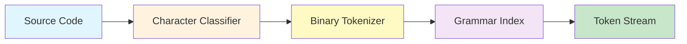

<div align="center">
  

[](https://github.com/chahuadev/chahuadev-Sentinel)
[](LICENSE)
[]()
[]()

> **A Revolutionary Pure Binary Parser** - Talking to computers in their native language: **Numbers, not Strings**
</div>

---

## The Story Behind Sentinel

### Why This Project Exists

I once built a string-based parser. It seemed elegant at first—splitting code by characters, matching patterns with regex, comparing strings to identify tokens. 

**Then reality hit:**

- **Memory exhausted** before parsing 1,000 lines of code
- **String comparisons** everywhere, thousands per second
- **Regex backtracking** causing exponential slowdowns
- **CPU pegged at 100%** just to read simple JavaScript

That's when I realized: **We've been talking to computers the wrong way.**

Computers don't "think" in strings—they think in **binary**. Every string comparison, every regex match, every character check forces the CPU to:
1. Fetch string data from memory (expensive)
2. Compare byte-by-byte (slow)
3. Handle UTF-8 encoding complexity (error-prone)
4. Repeat thousands of times per file (wasteful)

### The Epiphany

> **What if we spoke to the computer in its native language from the start?**

That's how **Sentinel** was born—a parser that uses **pure mathematics** instead of string manipulation. No regex. No string comparisons. Just **binary flags** and **integer arithmetic**.

---

## What is Sentinel?

**Sentinel** is a **language-agnostic tokenizer and parser** built on three revolutionary principles:

### 1. Pure Binary Tokenization
- Characters classified by **Unicode value ranges** (ASCII 65-90 = uppercase letters)
- Tokens identified by **binary flags** (0b00100000 = KEYWORD)
- Operators detected via **bitwise operations** (O(1) constant time)

**Result:** 10-100x faster than string-based parsers

### 2. Blank Paper Tokenizer
The tokenizer itself has **zero hardcoded knowledge** about any programming language.

```javascript
//  Traditional Parser (hardcoded knowledge)
if (token === 'async') {
  return Token.ASYNC_KEYWORD;
}

//  Sentinel (pure mathematical classification)
if (charCode >= 97 && charCode <= 122) {
  flags |= CHAR_FLAGS.LETTER;
}
```

**Why?** A "dumb" tokenizer can be **infinitely reused**. Just swap the "brain" (grammar file).

### 3. External Brain Architecture
All language knowledge lives in **grammar files** (JSON), not in code.

```
Tokenizer (dumb paper) + Grammar (brain) = Language Support
```

Want to parse Python? **Swap the grammar file.** No code changes needed.

---

## Quick Start

### Installation

```bash
npm install chahuadev-sentinel
```

### Basic Usage

```javascript
import { Sentinel } from 'chahuadev-sentinel';

// Parse JavaScript
const code = 'const x = 10;';
const tokens = Sentinel.tokenize(code, 'javascript');

console.log(tokens);
// [
//   { type: 'KEYWORD', binary: 32, value: 'const', start: 0, end: 5 },
//   { type: 'IDENTIFIER', binary: 1, value: 'x', start: 6, end: 7 },
//   { type: 'OPERATOR', binary: 8, value: '=', start: 8, end: 9 },
//   { type: 'NUMBER', binary: 2, value: '10', start: 10, end: 12 }
// ]
```

**That's it!** You don't need to understand binary to use Sentinel.

---

## Architecture Overview



**Visual Flow:** Source Code  Character Classification  Binary Tokenization  Grammar Lookup  Token Stream

### Detailed Flow Diagram

```
┌─────────────────────────────────────────────────────────────┐
│                    SOURCE CODE (Text)                       │
└─────────────────────────────────────────────────────────────┘
                            
┌─────────────────────────────────────────────────────────────┐
│          UniversalCharacterClassifier                       │
│  Reads Unicode values: 'a'  97  LETTER flag              │
└─────────────────────────────────────────────────────────────┘
                            
┌─────────────────────────────────────────────────────────────┐
│          PureBinaryTokenizer (Blank Paper)                  │
│  Groups characters by binary flags (no language knowledge)  │
└─────────────────────────────────────────────────────────────┘
                            
┌─────────────────────────────────────────────────────────────┐
│          GrammarIndex (External Brain)                      │
│  Consults grammar file: "Is 'const' a keyword?"            │
└─────────────────────────────────────────────────────────────┘
                            
┌─────────────────────────────────────────────────────────────┐
│          TOKEN STREAM (Semantic Binary Flags)               │
└─────────────────────────────────────────────────────────────┘
```

### Key Components

| Component | Role | Intelligence Level |
|-----------|------|-------------------|
| **UniversalCharacterClassifier** | Classifies characters by Unicode ranges | Mathematical (0%) |
| **PureBinaryTokenizer** | Groups characters into tokens | None (0%) |
| **GrammarIndex** | Provides language-specific knowledge | All (100%) |

---

## Core Principles

### Principle 1: Zero String Comparisons

**Traditional Parser:**
```javascript
if (token.value === 'async') // String comparison (slow)
```

**Sentinel:**
```javascript
if (token.binary === KEYWORD_BINARY.ASYNC) // Integer comparison (instant)
```

### Principle 2: Grammar Inheritance (Base + Delta)

Instead of duplicating grammar rules across languages:

```
java.grammar.json (Base)
  └─ Contains: if, for, while, class, interface, etc.

javascript.delta.json (Delta)
  └─ Adds: async, await, let, const, arrow functions
  └─ Removes: synchronized, volatile, strictfp

csharp.delta.json (Delta)
  └─ Adds: var, dynamic, LINQ, properties (get; set;)
  └─ Modifies: class (partial classes, primary constructors)
```

**Result:** 63% less code, 75% faster maintenance

### Principle 3: Universal Compatibility

Same tokenizer parses **any** programming language:
- **C-Family:** JavaScript, Java, C#, TypeScript, C++
- **Future:** Python, Go, Rust, Kotlin (just add grammar files)

---

## Current Status

### Phase 1: Foundation (COMPLETE)

**JavaScript Grammar: 100% Complete**
- 75 keywords (ES1-ES2024 + 16 Java-inspired reserved words)
- 92% with disambiguation rules
- 97% with quirks documentation
- 100% with code examples
- 50 operators with context-dependent disambiguation
- 15 punctuation symbols with multi-context handling

**Binary System: 100% Operational**
- 5-bit character classification system
- 24 punctuation binary constants
- Zero hardcoded string comparisons in tokenizer

### Phase 2: Base Grammar (IN PROGRESS)

**Goal:** Create `java.grammar.json` as the ultimate **Base Grammar** for C-Family languages

**Progress:**
- Java keywords: 58/68 (85%)
- Adding `cFamilyCommon` tags for inheritance
- Adding `inheritableBy` metadata

### Phase 3-5: Roadmap

- **Phase 3:** Enhance GrammarIndex with inheritance support
- **Phase 4:** Create delta files (JavaScript, C#, TypeScript)
- **Phase 5:** Build comparison engine for cross-language analysis

---

## For the "Crazy" Ones (Deep Dive)

### Binary Flag System

Every character gets a 5-bit classification:

```javascript
LETTER     = 0b00001  // 1
DIGIT      = 0b00010  // 2
WHITESPACE = 0b00100  // 4
OPERATOR   = 0b01000  // 8
PUNCTUATION= 0b10000  // 16
```

**Checking if character is alphanumeric:**
```javascript
if (flags & (LETTER | DIGIT)) // Bitwise AND (instant)
```

### Punctuation Binary Map

No more `if (char === '(')` comparisons:

```javascript
{
  "(": 1,
  ")": 2,
  "{": 3,
  "}": 4,
  "[": 5,
  "]": 6,
  ";": 7,
  // ... 24 punctuations total
}
```

**Usage:**
```javascript
if (token.punctuationBinary === PUNCT.PAREN_OPEN) // Integer check
```

### Grammar Inheritance Algorithm

```javascript
class GrammarIndex {
  loadGrammarWithInheritance(language) {
    const delta = require(`./grammars/${language}.delta.json`);
    
    if (delta._base) {
      const base = require(`./grammars/${delta._base}.grammar.json`);
      return this.mergeGrammars(base, delta);
    }
    
    return require(`./grammars/${language}.grammar.json`);
  }
  
  mergeGrammars(base, delta) {
    // Add delta keywords to base
    // Remove unwanted keywords
    // Modify existing keywords
    return merged;
  }
}
```

---

## Documentation

- [**Architecture Overview**](./docs/architecture/BASE_GRAMMAR_DELTA_ARCHITECTURE.md) - Base Grammar + Delta system explained in detail
- [**Test Suite Documentation**](./__tests__/README.md) - Testing Pyramid approach with Unit, Integration, and E2E tests
- [**Binary System Design**](./docs/BINARY_SYSTEM.md) - Character classification and flags *(coming soon)*
- [**Grammar File Format**](./docs/GRAMMAR_FORMAT.md) - How to write grammar files *(coming soon)*

---

## Use Cases

### 1. Code Analysis Tools
Build linters, formatters, or static analyzers **10-100x faster** than traditional AST parsers.

### 2. Language Servers
Power LSP (Language Server Protocol) implementations with instant token classification.

### 3. Code Transformation
Transform code between languages by leveraging shared C-Family grammar.

### 4. Educational Tools
Teach compiler design with a **pure mathematical** approach instead of regex magic.

---

## Contributing

We welcome contributions! Sentinel is in active development, and we're looking for:

- **Grammar Writers:** Help complete Java grammar, or create grammars for Python, Go, Rust
- **Performance Engineers:** Optimize binary operations further
- **Documentation Writers:** Help explain concepts clearly
- **Testers:** Test with real-world codebases

Please read our [Contributing Guidelines](./docs/CONTRIBUTING.md) *(coming soon)* before submitting pull requests.

---

## License

MIT License - see [LICENSE](LICENSE) file for details.

---

## Acknowledgments

Inspired by:
- **Acorn** & **Babel** - Proved that JavaScript parsers can be elegant
- **ANTLR** - Showed us grammar-driven parsing
- **Roslyn** (C#) - Demonstrated the power of compiler-as-a-service

But Sentinel takes a different path: **Pure Binary Mathematics** 

---

## Support & Contact

- **Issues:** [GitHub Issues](https://github.com/chahuadev/chahuadev-Sentinel/issues)
- **Discussions:** [GitHub Discussions](https://github.com/chahuadev/chahuadev-Sentinel/discussions)
- **Email:** chahuadev@gmail.com
- **Website:** https://chahuadev.com

---

## Project Status

**Version:** 2.0.0-alpha  
**Status:** Active Development  
**Maintenance:** Actively Maintained  
**Requirements:**
- Node.js >= 22.0.0
- VS Code >= 1.74.0 (for extension)

---

<div align="center">

**Built by Chahua Development Co., Ltd.**

*"Talk to computers in their native language—not yours."*

</div>