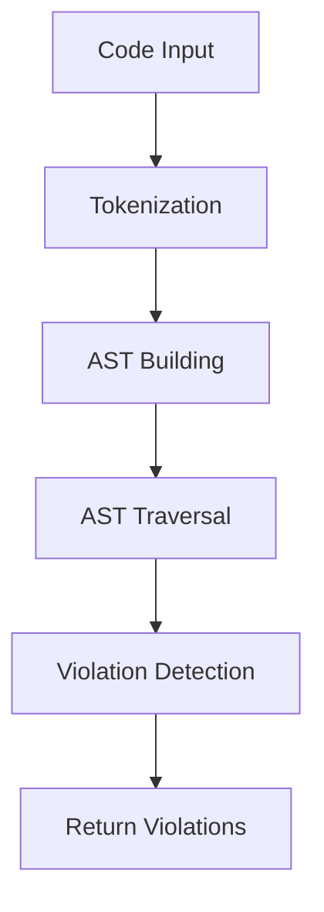

#  Smart Parser Engine - แผนที่โซนทั้งหมด (Complete Zone Map)

##  ภาพรวมไฟล์

**ไฟล์:** `src/grammars/shared/smart-parser-engine.js`  
**จำนวนบรรทัด:** ~3,000 บรรทัด  
**จำนวนโซนหลัก:** 20+ โซน  
**วัตถุประสงค์:** Parser engine ที่สร้างขึ้นเองเพื่อแปลง JavaScript code  AST และตรวจจับ violations

---

##  โครงสร้างไฟล์ทั้งหมด

```
┌──────────────────────────────────────────────────────────────────┐
│   SECTION 1: HEADER & SETUP (บรรทัด 1-33)                      │
├──────────────────────────────────────────────────────────────────┤
│  ├─ Zone 1.1: File Header (1-8)                                  │
│  ├─ Zone 1.2: Imports (10-16)                                    │
│  └─ Zone 1.3: Configuration Loader (18-33)                       │
└──────────────────────────────────────────────────────────────────┘

┌──────────────────────────────────────────────────────────────────┐
│   SECTION 2: JAVASCRIPT TOKENIZER (บรรทัด 34-204)             │
├──────────────────────────────────────────────────────────────────┤
│  ├─ Constructor (35-40)                                          │
│  ├─ tokenize() - Main method (42-53)                             │
│  ├─ tokenizeLine() - Core tokenization (55-135)                  │
│  └─ Helper methods (137-204)                                     │
│      ├─ parseString()                                            │
│      ├─ parseNumber()                                            │
│      ├─ parseIdentifier()                                        │
│      ├─ isKeyword()                                              │
│      └─ addToken()                                               │
└──────────────────────────────────────────────────────────────────┘

┌──────────────────────────────────────────────────────────────────┐
│   SECTION 3: STRUCTURE PARSER BASE (บรรทัด 206-220)          │
├──────────────────────────────────────────────────────────────────┤
│  └─ Base class สำหรับ structure parsing                         │
└──────────────────────────────────────────────────────────────────┘

┌──────────────────────────────────────────────────────────────────┐
│   SECTION 4: ADVANCED STRUCTURE PARSER (บรรทัด 221-1006)      │
├──────────────────────────────────────────────────────────────────┤
│  ├─ Zone 4.1: Class Definition (221-236)                         │
│  ├─ Zone 4.2: Main Entry - parse() (238-260)                     │
│  ├─ Zone 4.3: Statement Router (262-286)                         │
│  ├─ Zone 4.4: Function Parser (288-306)                          │
│  ├─ Zone 4.5: Variable Parser (308-336)                          │
│  ├─ Zone 4.6: Expression Parsers (338-375)                       │
│  │   ├─ parseExpression()                                        │
│  │   ├─ parseAssignmentExpression()                             │
│  │   └─ parseLogicalExpression()                                │
│  ├─ Zone 4.7: Helper Methods (378-424)                           │
│  │   ├─ peek(), advance(), isAtEnd()                            │
│  │   ├─ match(), matchOperator()                                │
│  │   ├─ consume(), consumeSemicolon()                           │
│  │   └─ parseIdentifier()                                       │
│  ├─ Zone 4.8: Parameter & Block (426-457)                        │
│  │   ├─ parseParameterList()                                    │
│  │   └─ parseBlockStatement()                                   │
│  ├─ Zone 4.9: Expression Statement (459-473)                     │
│  ├─ Zone 4.10: Equality & Comparison (576-622)                   │
│  │   ├─ parseEqualityExpression()                               │
│  │   ├─ parseRelationalExpression()                             │
│  │   └─ parseAdditiveExpression()                               │
│  ├─ Zone 4.11: Multiplicative & Unary (721-757)                  │
│  │   ├─ parseMultiplicativeExpression()                         │
│  │   └─ parseUnaryExpression()                                  │
│  ├─ Zone 4.12: Postfix Expressions (760-799)                     │
│  │   └─ parsePostfixExpression()                                │
│  ├─ Zone 4.13: Primary Expressions (802-853)                     │
│  │   └─ parsePrimaryExpression()                                │
│  ├─ Zone 4.14: Argument List (856-870)                           │
│  │   └─ parseArgumentList()                                     │
│  ├─ Zone 4.15: Legacy parse() Method (1007-1106)                 │
│  │   └─ Simple structure detection                              │
│  └─ Zone 4.16: Structure Helpers (1108-1231)                     │
│      ├─ parseFunctionDeclaration()                              │
│      ├─ parseAsyncFunction()                                    │
│      ├─ hasAwaitInFunction()                                    │
│      ├─ hasTryCatchInFunction()                                 │
│      ├─ parseTryBlock()                                         │
│      ├─ hasCatchAfterTry()                                      │
│      ├─ hasFinallyAfterTry()                                    │
│      └─ parseClass()                                            │
└──────────────────────────────────────────────────────────────────┘

┌──────────────────────────────────────────────────────────────────┐
│   SECTION 5: SIMPLE JAVASCRIPT PARSER (บรรทัด 1233-1488)      │
├──────────────────────────────────────────────────────────────────┤
│  ├─ Constructor (1234-1237)                                      │
│  ├─ parse() (1240-1251)                                          │
│  ├─ tokenizeSimple() (1253-1387)                                 │
│  └─ Helper methods (1389-1488)                                   │
│      ├─ parseStringLiteral()                                    │
│      ├─ parseNumber()                                           │
│      ├─ parseIdentifier()                                       │
│      ├─ parseStatements()                                       │
│      └─ getLastLocation()                                       │
└──────────────────────────────────────────────────────────────────┘

┌──────────────────────────────────────────────────────────────────┐
│   SECTION 6: SMART FILE ANALYZER (บรรทัด 1490-1684)           │
├──────────────────────────────────────────────────────────────────┤
│  ├─ Constructor (1491-1521)                                      │
│  ├─ performCodeHealthCheck() (1524-1544)                         │
│  ├─ checkBraceBalance() (1546-1573)                              │
│  ├─ analyzeIntent() (1576-1603)                                  │
│  └─ processLargeFileInChunks() (1606-1634)                       │
└──────────────────────────────────────────────────────────────────┘

┌──────────────────────────────────────────────────────────────────┐
│   SECTION 7: SMART PARSER ENGINE (บรรทัด 1687-3003)           │
├──────────────────────────────────────────────────────────────────┤
│  ├─ Zone 7.1: Constructor (1687-1730)                            │
│  │   ├─ Configuration validation                                │
│  │   ├─ Component initialization                                │
│  │   └─ Memory protection setup                                 │
│  ├─ Zone 7.2: analyzeCode() (1737-1795)                          │
│  │   ├─ Circuit breaker checks                                  │
│  │   ├─ Tokenization                                            │
│  │   ├─ AST building                                            │
│  │   └─ Violation detection                                     │
│  ├─ Zone 7.3: traverseAST() (1800-1857)                          │
│  │   ├─ Recursive tree walker                                   │
│  │   ├─ Node type checking                                      │
│  │   └─ Violation checker calls                                 │
│  ├─ Zone 7.4: Violation Checkers (1859-2064)                     │
│  │   ├─ checkMockingInAST()                                     │
│  │   ├─ checkHardcodeInAST()                                    │
│  │   ├─ checkNumericHardcodeInAST()                             │
│  │   ├─ checkSilentFallbacksInAST()                             │
│  │   ├─ checkLogicalFallbacksInAST()                            │
│  │   ├─ checkPromiseCatchFallbacks()                            │
│  │   ├─ checkAsyncFunctionWithoutTryCatch()                     │
│  │   ├─ traverseNodeForPatterns()                               │
│  │   ├─ checkCachingInAST()                                     │
│  │   ├─ checkCachingPropertyInAST()                             │
│  │   ├─ checkMemoizationInAST()                                 │
│  │   └─ checkEmojiInAST()                                       │
│  ├─ Zone 7.5: detectViolations() (2066-2085)                     │
│  │   └─ Legacy violation detection                              │
│  └─ Zone 7.6: Specific Detectors (2087-3000)                     │
│      ├─ detectEmojiViolations()                                 │
│      ├─ detectHardcodeViolations()                              │
│      ├─ detectSilentFallbackViolations()                        │
│      ├─ detectCachingViolations()                               │
│      ├─ detectMockingViolations()                               │
│      └─ estimateLineFromMatch()                                 │
└──────────────────────────────────────────────────────────────────┘

┌──────────────────────────────────────────────────────────────────┐
│   SECTION 8: EXPORTS (บรรทัด 3003)                            │
└──────────────────────────────────────────────────────────────────┘
```

---

##  สรุปรายละเอียดแต่ละ Section

###  SECTION 1: HEADER & SETUP (บรรทัด 1-33)

**งานหลัก:** Initialize และโหลด configuration

| Zone | บรรทัด | งานที่ทำ |
|------|-------|----------|
| 1.1 | 1-8 | File header และ copyright info |
| 1.2 | 10-16 | Import dependencies (constants, fs, GrammarIndex) |
| 1.3 | 18-33 | โหลด parser-config.json (NO_HARDCODE) |

**Key Points:**
-  ไม่มี hardcoded values
-  Strict config validation
-  Throw error ถ้าโหลด config ไม่สำเร็จ

---

###  SECTION 2: JAVASCRIPT TOKENIZER (บรรทัด 34-204)

**งานหลัก:** แยกโค้ด JavaScript เป็น tokens (Lexical Analysis)

**Methods:**

| Method | บรรทัด | งานที่ทำ |
|--------|-------|----------|
| `constructor()` | 35-40 | รับ grammarIndex |
| `tokenize()` | 42-53 | แยกโค้ดเป็นบรรทัดและ tokenize |
| `tokenizeLine()` | 55-135 | Core tokenization logic |
| `parseString()` | 137-158 | แยก string literals |
| `parseNumber()` | 160-170 | แยก numbers |
| `parseIdentifier()` | 172-185 | แยก identifiers |
| `isKeyword()` | 187-189 | เช็ค keyword |
| `addToken()` | 191-199 | เพิ่ม token ลง array |

**Token Types ที่รองรับ:**
- `COMMENT` - // และ /* */
- `STRING` - "..." '...' `...`
- `NUMBER` - 123, 3.14
- `KEYWORD` - function, const, let, var, if, for, etc.
- `IDENTIFIER` - myVar, foo, _private
- `OPERATOR` - +, -, ===, +=, etc.
- `PUNCTUATION` - (, ), {, }, [, ], ;, ,

**Features:**
-  ข้าม non-ASCII characters (ภาษาไทย, emoji)
-  Throw error สำหรับ unrecognized characters
-  ใช้ grammarIndex สำหรับ validation

---

###  SECTION 3: STRUCTURE PARSER BASE (บรรทัด 206-220)

**งานหลัก:** Base class สำหรับ structure parsing

**Properties:**
```javascript
{
    tokens: [],           // รายการ tokens
    structures: {
        functions: [],    // function declarations
        classes: [],      // class declarations
        asyncFunctions: [], // async functions
        tryBlocks: [],    // try-catch blocks
        imports: [],      // import statements
        exports: []       // export statements
    }
}
```

---

###  SECTION 4: ADVANCED STRUCTURE PARSER (บรรทัด 221-1231)

**งานหลัก:** สร้าง Full AST (Abstract Syntax Tree) แบบ ESTree format

####  Operator Precedence Chain

```
parseExpression()
  
parseAssignmentExpression() (=, +=, -=)       precedence 1 (ต่ำสุด)
  
parseLogicalExpression() (&&, ||, ??)         precedence 2
  
parseEqualityExpression() (===, !==)          precedence 3
  
parseRelationalExpression() (<, >, <=, >=)    precedence 4
  
parseAdditiveExpression() (+, -)              precedence 5
  
parseMultiplicativeExpression() (*, /, %)     precedence 6
  
parseUnaryExpression() (!, -, +, typeof)      precedence 7
  
parsePostfixExpression() (., [], ())          precedence 8
  
parsePrimaryExpression() (literals)           precedence 9 (สูงสุด)
```

####  Key Zones

| Zone | บรรทัด | Method | งานที่ทำ |
|------|-------|--------|----------|
| 4.1 | 221-236 | constructor | Initialize AST root |
| 4.2 | 238-260 | parse() | Main entry point |
| 4.3 | 262-286 | parseStatement() | Route statements |
| 4.4 | 288-306 | parseFunctionDeclaration() | Parse functions |
| 4.5 | 308-336 | parseVariableDeclaration() | Parse variables |
| 4.6 | 338-375 | Expression parsers | Parse expressions |
| 4.7 | 378-424 | Helper methods | Token navigation |
| 4.8 | 426-457 | Parameter & Block | Parse (params) {...} |
| 4.9 | 459-473 | parseExpressionStatement() | Parse expr statements |
| 4.10 | 576-622 | Comparison parsers | Parse ==, <, +, - |
| 4.11 | 721-757 | Multiplicative & Unary | Parse *, /, !, typeof |
| 4.12 | 760-799 | parsePostfixExpression() | Parse obj.prop, func() |
| 4.13 | 802-853 | parsePrimaryExpression() | Parse literals |
| 4.14 | 856-870 | parseArgumentList() | Parse (arg1, arg2) |

**AST Node Types สร้าง:**
- `Program` - Root node
- `FunctionDeclaration` - function foo() {}
- `VariableDeclaration` - const x = 5
- `AssignmentExpression` - x = 5
- `LogicalExpression` - x && y
- `BinaryExpression` - x + y
- `UnaryExpression` - !x
- `MemberExpression` - obj.prop
- `CallExpression` - foo()
- `Literal` - 42, "hello"
- `Identifier` - myVar

---

###  SECTION 5: SIMPLE JAVASCRIPT PARSER (บรรทัด 1233-1488)

**งานหลัก:** Simple fallback parser (ไม่ต้องการ full AST)

**Usage:** สำหรับ quick analysis หรือ fallback

**Methods:**
- `parse()` - Main entry
- `tokenizeSimple()` - Simple tokenization
- `parseStringLiteral()`, `parseNumber()`, `parseIdentifier()`
- `parseStatements()` - Basic statement parsing
- `getLastLocation()` - Get end location

---

###  SECTION 6: SMART FILE ANALYZER (บรรทัด 1490-1684)

**งานหลัก:** Pre-analysis health checks และ optimization

| Method | งานที่ทำ |
|--------|----------|
| `performCodeHealthCheck()` | ตรวจสอบ file size และ syntax |
| `checkBraceBalance()` | เช็ค { } balance |
| `analyzeIntent()` | วิเคราะห์เจตนาของโค้ด |
| `processLargeFileInChunks()` | แบ่งไฟล์ใหญ่เป็น chunks |

**Intent Categories:**
- `security` - auth, encrypt, token
- `businessLogic` - calculate, validate, process
- `algorithm` - sort, search, optimize
- `dataManagement` - database, cache, store
- `apiIntegration` - fetch, request, endpoint

---

###  SECTION 7: SMART PARSER ENGINE (บรรทัด 1687-3003)

**งานหลัก:** Main engine ที่รวมทุกอย่างเข้าด้วยกัน

####  Core Flow



####  Key Components

**7.1 Constructor:**
- โหลด config (strict validation)
- สร้าง GrammarIndex
- สร้าง Tokenizer
- สร้าง Analyzer
- ตั้งค่า memory protection

**7.2 analyzeCode():**
- Circuit breaker check
- Tokenize code
- Build full AST
- Traverse AST
- Detect violations

**7.3 traverseAST():**
- Walk AST recursively
- Check each node type
- Call violation checkers

**7.4 Violation Checkers:**

| Checker | ตรวจจับอะไร |
|---------|------------|
| `checkMockingInAST()` | jest.mock(), sinon.stub() |
| `checkHardcodeInAST()` | Credentials, API keys, URLs |
| `checkNumericHardcodeInAST()` | Hardcoded numbers |
| `checkSilentFallbacksInAST()` | Empty catch blocks |
| `checkLogicalFallbacksInAST()` | \|\| [], \|\| {} |
| `checkPromiseCatchFallbacks()` | .catch(() => {}) |
| `checkAsyncFunctionWithoutTryCatch()` | async without try-catch |
| `checkCachingInAST()` | Cache variables |
| `checkMemoizationInAST()` | Memoization functions |
| `checkEmojiInAST()` | Emoji characters |

####  Memory Protection

```javascript
{
    maxTokensPerAnalysis: 100000,    // Max tokens per file
    maxMemoryUsage: 512MB,           // Max heap usage
    maxAnalysisCount: 1000,          // Max analyses per session
    maxASTNodes: 50000               // Max AST nodes
}
```

**Circuit Breaker:**
-  Check memory usage before analysis
-  Count analysis iterations
-  Limit AST node traversal
-  Throw error when limits exceeded

---

##  การทำงานโดยรวม (Overall Flow)

### 1 Initialization Phase

```javascript
const engine = new SmartParserEngine(combinedGrammar, config);
//  โหลด config
//  สร้าง GrammarIndex
//  สร้าง Tokenizer, Analyzer
```

### 2 Analysis Phase

```javascript
const result = engine.analyzeCode(code);
//  Circuit breaker check
//  Tokenize: code  tokens
//  Build AST: tokens  AST
//  Traverse: AST  violations
//  Return: { violations, parseSuccess }
```

### 3 Token Flow

```
Code String
    
JavaScriptTokenizer.tokenize()
    
Tokens Array [
    { type: 'KEYWORD', value: 'function', location: {...} },
    { type: 'IDENTIFIER', value: 'foo', location: {...} },
    ...
]
```

### 4 AST Building Flow

```
Tokens Array
    
AdvancedStructureParser.parse()
    
parseStatement()  route to specific parser
    
parseFunctionDeclaration() / parseVariableDeclaration() / etc.
    
AST Tree {
    type: 'Program',
    body: [
        { type: 'FunctionDeclaration', ... },
        { type: 'VariableDeclaration', ... },
        ...
    ]
}
```

### 5 Violation Detection Flow

```
AST Tree
    
traverseAST()  walk recursively
    
For each node:
    ├─ checkMockingInAST()
    ├─ checkHardcodeInAST()
    ├─ checkSilentFallbacksInAST()
    ├─ checkCachingInAST()
    └─ checkEmojiInAST()
    
Violations Array [
    {
        ruleId: 'NO_MOCKING',
        severity: 'ERROR',
        message: '...',
        location: { line: 10, column: 5 }
    },
    ...
]
```

---

##  Performance & Optimization

### Memory Management

| Feature | Implementation |
|---------|---------------|
| Token Limit | Max 100,000 tokens per file |
| Memory Limit | Max 512 MB heap usage |
| AST Node Limit | Max 50,000 nodes |
| Analysis Limit | Max 1,000 analyses per session |

### Optimization Techniques

1. **Chunking**: แบ่งไฟล์ใหญ่เป็น chunks
2. **Lazy Evaluation**: Parse เฉพาะที่จำเป็น
3. **Circuit Breaker**: หยุดเมื่อเกินขีดจำกัด
4. **Error Recovery**: ทำงานต่อเมื่อเจอ error

---

##  Debugging Tips

### ดู Token Output

```javascript
const tokenizer = new JavaScriptTokenizer(grammarIndex);
const tokens = tokenizer.tokenize(code);
console.log(JSON.stringify(tokens, null, 2));
```

### ดู AST Output

```javascript
const parser = new AdvancedStructureParser(tokens, grammarIndex);
const ast = parser.parse();
console.log(JSON.stringify(ast, null, 2));
```

### ดู Violations

```javascript
const engine = new SmartParserEngine(grammar, config);
const result = engine.analyzeCode(code);
console.log('Violations:', result.violations);
```

---

##  สรุปสุดท้าย

**Smart Parser Engine** เป็น parser engine ที่:

 **สร้างขึ้นเองทั้งหมด** - ไม่ใช้ Babel, Acorn, หรือ library ภายนอก  
 **Full AST Generation** - สร้าง AST แบบ ESTree format  
 **Comprehensive Violation Detection** - ตรวจจับ 5+ กฎหลัก  
 **Memory Protected** - มี circuit breaker และ limits  
 **NO_HARDCODE Compliant** - ใช้ external configuration  
 **Error Resilient** - ทำงานต่อเมื่อเจอ error  
 **Well Documented** - มี zone markers และ comments ละเอียด  

---

**เอกสารสร้างเมื่อ:** 8 ตุลาคม 2025  
**Total Lines:** ~3,000 บรรทัด  
**Total Zones:** 20+ โซน  
**Total Methods:** 50+ methods
